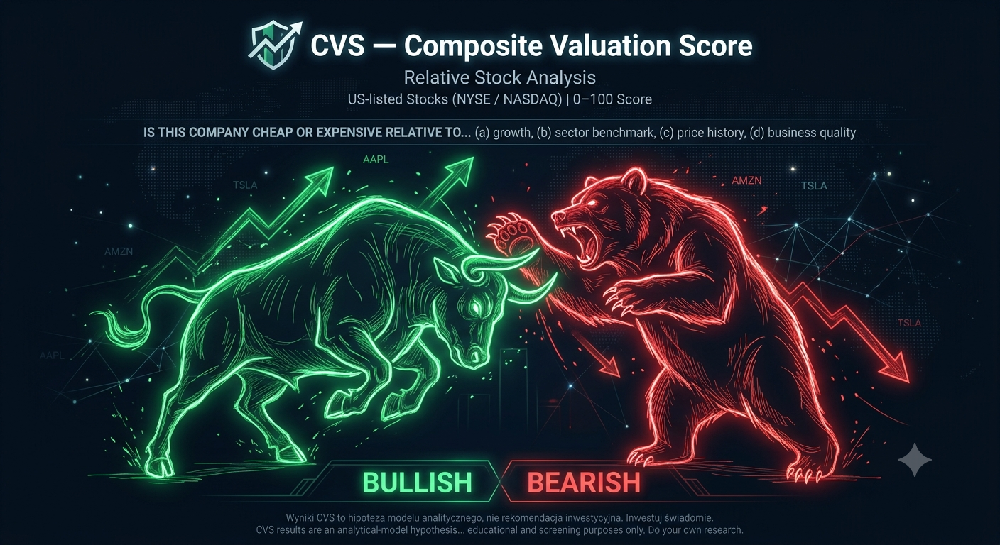

# CVS — Composite Valuation Score

**Czy ta spółka jest tania czy droga?** CVS odpowiada jedną liczbą — oceniając spółkę nie przez pryzmat ceny bezwzględnej, ale względem sektora, dynamiki przychodów i jakości biznesu jednocześnie.

🔗 **Live:** https://cvs.timeflow.fun/


> ⚠️ **Disclaimer:** Wyniki CVS to hipoteza modelu analitycznego, nie rekomendacja
> inwestycyjna. Inwestuj świadomie. CVS results are an analytical-model hypothesis,
> **not investment advice**. For educational and screening purposes only.

---

## Dlaczego CVS

Tradycyjne wskaźniki wyceny (P/E, P/S, PEG) mówią *ile płacisz*, ale nie *czy to dużo*. Spółka przy P/E 40 może być tania, jeśli rośnie 60% rocznie; spółka przy P/E 12 może być droga, jeśli zwalnia. CVS odpowiada na pytanie relatywne w kilku wymiarach jednocześnie:

> *Czy ta spółka jest tania czy droga względem (a) własnego wzrostu, (b) mediany sektora, (c) swojej historii cenowej i (d) jakości fundamentalnej?*

Model jest świadomie **wartościowy i kontrariański** — nazwie drogi papier "Unikaj", nawet gdy analitycy mówią "Kupuj". Ta rozbieżność jest informacją, nie błędem. Aplikacja w fazie 2 wyjaśnia tę rozbieżność przez analizę AI.

---

## Model CVS

Trzy filary, dwa tryby równolegle (surowe wyniki pilarów są identyczne, różnią się tylko wagi):

| Filar | Swing (1–4M) | Fundamentalny (6–12M) | Co mierzy |
|---|:---:|:---:|---|
| **Wycena** | 40% | 65% | EV/FCF vs mediany sektora |
| **Momentum** | 45% | 15% | ROC ceny vs SPY (excess return) |
| **Jakość** | 15% | 20% | Marża brutto, dźwignia, wzrost forward |

**Skala rekomendacji:**

| Score | Etykieta |
|---|---|
| ≥ 72 | ⬆⬆ SILNE KUPUJ |
| 58–71 | ⬆ AKUMULUJ |
| 42–57 | → NEUTRALNIE |
| 28–41 | ⬇ REDUKUJ |
| < 28 | ⬇⬇ UNIKAJ |

**Złote sygnały:** ⭐⭐ gdy oba tryby ≥ 58 (wartość *i* momentum), ⭐ gdy tylko tryb fundamentalny (setup — czekaj na momentum).

Wszystkie parametry (wagi, progi, benchmarki sektorowe) są w jednym pliku konfiguracyjnym, nigdy zahardkodowane. Rdzeń modelu jest **deterministyczny** — te same dane zawsze dają ten sam wynik.

---

## Model cieniowy (shadow model_version)

Obok headline'owego wyniku 3.0 model liczy równolegle dwa **shadow modele** —
eksperymentalne korekty post-agregacyjne, zapisywane do snapshotów obok 3.0,
ale **nigdy niezmieniające wyświetlanej rekomendacji** (FR-016/FR-020).

| Wersja | Charakter | Co dokłada |
|---|---|---|
| **3.1** | Tylko kary (hamulce) | Kara za cięte prognozy EPS (rewizja), bramka cena vs target analityków, symetryczny guard okołowynikowy |
| **3.2** | Symetryczne sygnały oczekiwań | Kierunkowy guard PEAD (beat neutralizuje karę z 3.1, miss ją wzmacnia), szerokość rewizji prognoz, dystans do 52-tygodniowego maksimum, konsystencja "beatów" w ostatnich 4 kwartałach |

3.2 dziedziczy kary rewizji/targetu z 3.1 bez ponownego liczenia (anty-dryf) i
zastępuje symetryczny guard okołowynikowy kierunkowym PEAD-em. Surowe wartości
sygnałów (`surprise_pct`, `breadth`, `52w proximity`, `beat_count_4q`) trafiają
do snapshotów jako JSON — korpus do przyszłego grid-search/rekalibracji.

Na detalu spółki oba shadow modele pokazują się jako chipy "Podgląd 3.1" /
"Podgląd 3.2" pod headline'owymi wynikami — informacyjnie, eksperymentalnie.

---

## Funkcjonalności

### Rdzeń analityczny
- 🔐 Konta użytkowników (email + hasło), izolacja danych per konto
- 📊 Analiza do 10 tickerów jednocześnie, ranking wg CVS (oba tryby)
- 🕸️ Radar chart trzech pilarów per spółka
- 🔎 Panel szczegółów z surowymi danymi finansowymi
- 📈 12-miesięczny wykres kursu vs SPY (benchmark S&P 500, indeks baza=100)
- 🎯 Karta prognoz analityków — cele cenowe, konsensus rekomendacji
- ⭐ Watchlist z autocompletą ~600 spółek (S&P 500 + NASDAQ 100)
- 🕘 Historia analiz

### System sygnalizacyjny (Faza 2)
- 🤖 **Analiza AI** — Claude Sonnet 4.6 wyjaśnia *dlaczego* CVS i analitycy się rozmijają (4-sekcyjna narracja PL, shared cache 7 dni, brama PRO)
- 📉 **CVS Fair Value** — cena implikowana przez model (parytet sektorowy EV/FCF), widoczna na fan chart analityków
- 🧭 **Screener CVS** — ranking watchlisty z filtrami (sektor, rekomendacja, golden signal, min CVS) i sortem
- 🔔 **Alerty watchlisty** — mail gdy spółka zmieni rekomendację lub złoty sygnał; deduplikacja, ON/OFF per user i per ticker
- 📚 **Track record modelu** — historyczna trafność rekomendacji CVS vs późniejsza cena
- ℹ️ **Informacje o spółce** — opis biznesowy z Yahoo Finance (zero dodatkowych API callów)

### Wirtualny Portfel (autonomiczny)
- 🤖 **Autonomiczny zarządca CVS + LLM** — globalny portfel papierowy ($10 000), strategia swing 1–4M, rebalans w sesji NYSE
- 🛡️ **Twarde guardy po stronie serwera** — limit sektorowy/spółki, stop-loss wymuszany niezależnie od LLM (`DecisionEnforcer`)
- 🎯 **Reguły wyjścia P&L** — twardy stop-loss (−15%), miękki take-profit (+25%), histereza wejścia/wyjścia 58/54
- 🔁 **Ograniczone retry** — do 3 prób dziennego cyklu sterowane cronem, idempotencja per data (`claimForRun`)
- 💹 **Ceny live** — odświeżanie kursów na stronie (cache 15 min, fallback do snapshotu), P&L per pozycja, ⓘ z uzasadnieniem
- 📖 Pełna dokumentacja: **[docs/autonomous-portfolio.md](docs/autonomous-portfolio.md)**

### Infrastruktura
- 🔑 **Dostęp PRO** — kody per user wydawane przez admina, brama chroniąca generowanie AI, limity 10/dzień + 100/miesiąc
- 📧 **Maile transakcyjne** — PHPMailer + SMTP, alerty + formularz prośby o kod PRO
- 🗓️ **Dzienny re-scoring** — cron CF 2×/dzień, snapshoty CVS zasilające screener i track record

---

## Stack technologiczny

| Warstwa | Technologia |
|---|---|
| Backend | PHP 8.2, vanilla (PSR-4, `CVS\` namespace), brak frameworka |
| Baza danych | MySQL via PDO singleton |
| Frontend | Vanilla PHP templates, plain CSS (tokens + components), Chart.js |
| AI | Claude API (Anthropic) — Sonnet 4.6, prompt caching |
| Email | PHPMailer + SMTP CF |
| Dane rynkowe | Yahoo Finance (cURL, session cache 1h) |
| Testy | PHPUnit 11 (417 testów offline), PHPStan level 6 |
| Hosting | Cyber_Folks (shared), Apache, cron CLI |
| Deploy | SSH + git pull ręczny |

---

## Szybki start

```bash
# 1. Zależności
composer install

# 2. Środowisko
cp .env.example .env   # uzupełnij DB, ANTHROPIC_API_KEY, SMTP

# 3. Migracje MySQL
# wgraj kolejno database/migrations/*.sql

# 4. Dev server (document root = public/)
php -S localhost:8000 -t public
```

Testy (w pełni offline — brak callów do API):

```bash
vendor/bin/phpunit
vendor/bin/phpstan analyse
```

---

## Struktura projektu

```
src/
  Core/        Router, Request, Response, Database
  Auth/        AuthController, UserRepository
  CVS/         CVSModel, CVSResult, AnalysisController, Pillars/
  Api/          FinancialDataFetcher (Yahoo Finance)
  Ai/          ClaudeClient, AiDivergenceService, AiAnalysisController
  Alerts/      AlertRepository, AlertService, AlertController
  Mail/        MailService (PHPMailer wrapper)
  Pro/         ProGate, ProRepository, AiUsageRepository
  Screener/    ScreenerRepository, ScreenerController
  TrackRecord/ CvsSnapshotRepository, TrackRecordRepository
config/
  cvs-weights.php   parametry modelu (NIGDY hardkodowane)
  ai.php            Claude API config
  mail.php          SMTP config
templates/     Plain-PHP views
public/        Front controller + assets (CSS, JS, images)
database/      Migracje SQL (001–017)
bin/           rescore.php (cron), gen_favicon.php
```

---

## Konwencje kodu

- `declare(strict_types=1)` w każdym pliku PHP
- UI strings → **polski**; identyfikatory kodu, komentarze, docbloki → **angielski**
- Nowe trasy wyłącznie w `src/Core/routes.php`; CSRF weryfikowany na każdym POST
- PHPStan level 6 musi być zielony przed każdym commitem

---

*Projekt osobisty. Bez afiliacji z brokerami ani dostawcami danych. Dane rynkowe z publicznych endpointów Yahoo Finance.*
